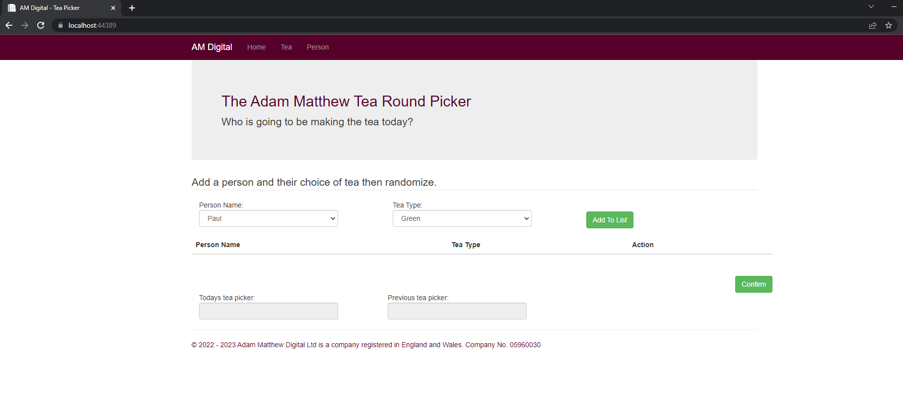
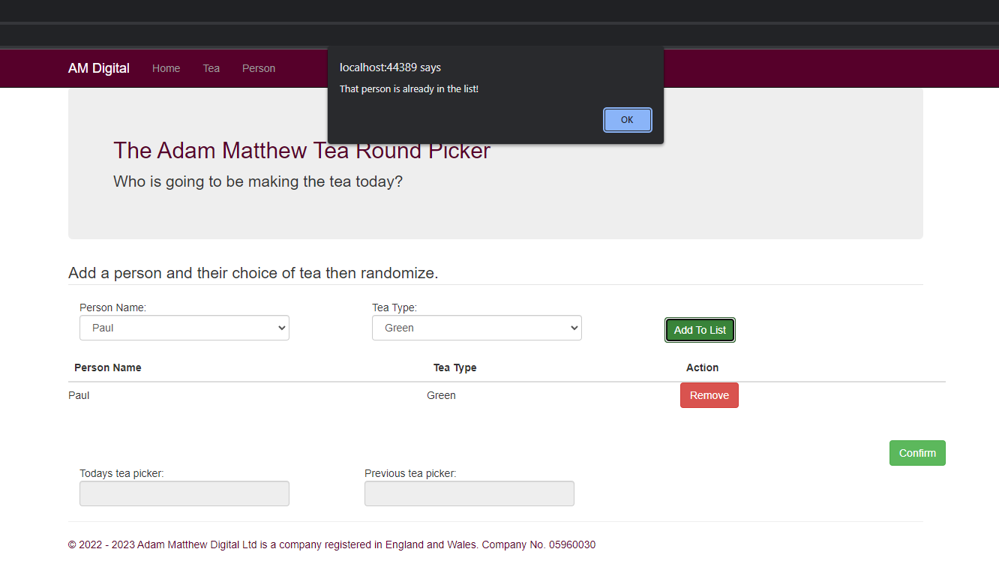
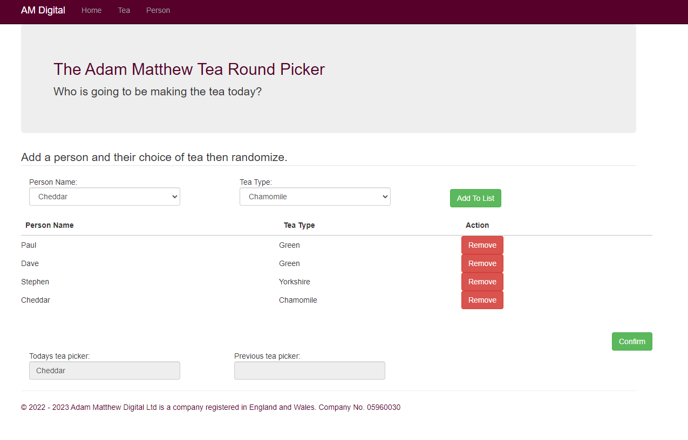
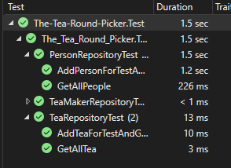
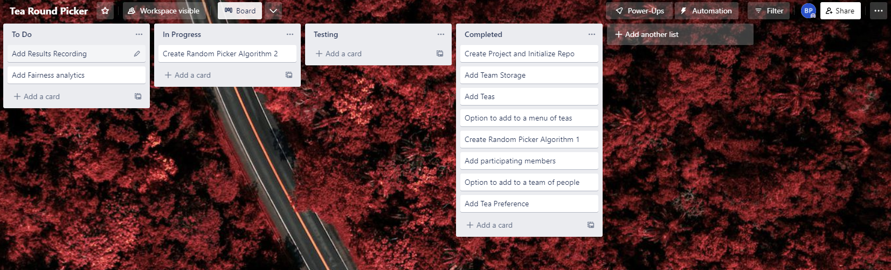

# AM-The-Tea-Round-Picker
Repo for a Tea Round Picker for AM Digital. Built with SQL, .NET Framework 4.7.2, following MVC framework and a repository design pattern.

## Visual Studio and SQL Server

#### Prerequisites

- SQL Server
- Visual Studio (Built in 2022)

#### Steps to run

- Restore DB Backup file via SSMS.
- Open TeaPickerDbModel.edmx file and update model from database, should update based on device windows authentication (TODO: maybe consider using login / pass for consideration of backup / restore of db) of the restored db in step above 
- In Solution Explorer, make sure that AM-The-Tea-Round-Picker is selected as the Startup Project.
- In Visual Studio, press "Control + F5".

## High level architecture
- MVC Framework : https://learn.microsoft.com/en-us/aspnet/mvc/
- Repository Design Pattern : https://learn.microsoft.com/en-us/aspnet/mvc/overview/older-versions/getting-started-with-ef-5-using-mvc-4/implementing-the-repository-and-unit-of-work-patterns-in-an-asp-net-mvc-application

#### Landing Page

### Test Coverage 

### Task Tracking  

